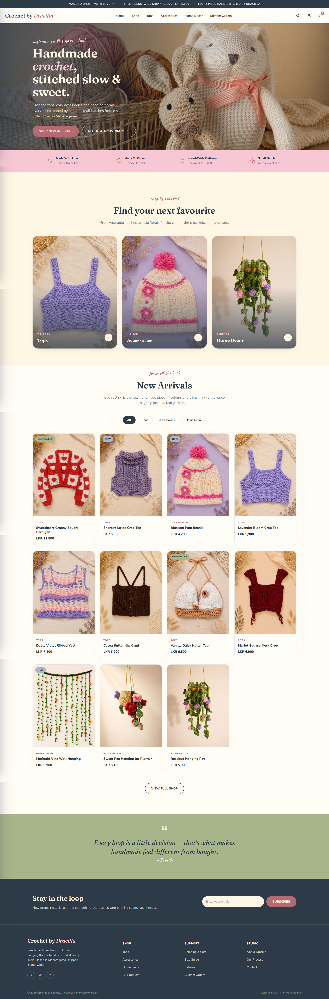
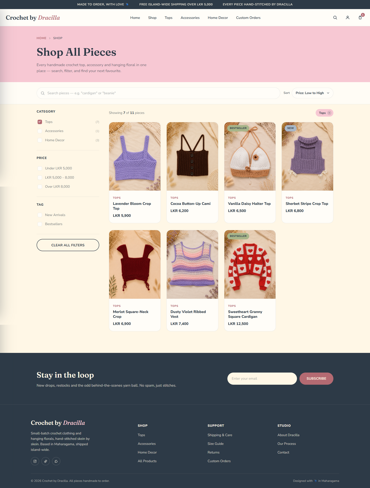
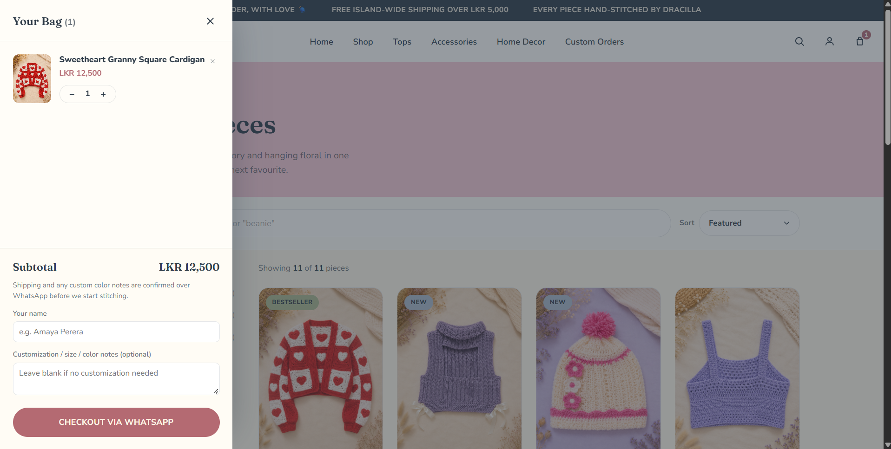
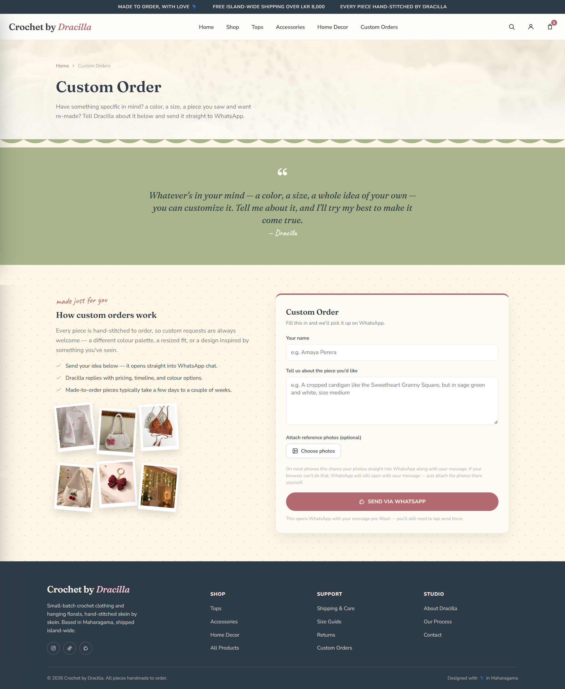

# Crochet by Dracilla 🧶

A handmade crochet clothing & home decor storefront. Static HTML/CSS/vanilla JS, no framework, no build step. Hosted on Vercel.


## Screenshots

| Home | Shop |
|---|---|
|  |  |

| Cart | Custom Orders |
|---|---|
|  |  |

## Pages

| Page | Purpose |
|---|---|
| `index.html` | Homepage — hero, categories, New Arrivals |
| `shop.html` | Full catalog — search, filters, sort, cart |
| `custom-orders.html` | Custom order request form → WhatsApp |
| `admin.html` | Passcode-gated tool to build/edit `products.json` |
| `admin-login.html` | Passcode entry for `admin.html` |

## Features

- CSS custom properties for the brand palette & type scale (`style.css`), shared across all pages
- Searchable, filterable, sortable shop page
- Slide-out cart, saved to `localStorage`, shared across pages
- Checkout via WhatsApp (`wa.me` link) — no payment gateway
- Custom order form → WhatsApp, with optional photo attachments
- Product admin tool — builds `products.json`, no database
- Admin gated by `middleware.js` (passcode cookie, fails closed)
- WhatsApp number served via `api/config.js` from an env var, not hardcoded
- Fully responsive, accessible, zero dependencies besides Google Fonts

## Tech stack

| Layer | Choice |
|---|---|
| Markup/Styling/JS | Plain HTML5, CSS3, vanilla JS |
| Data | `products.json`, fetched at runtime |
| Auth | Vercel Edge Middleware (`middleware.js`) |
| Config | `api/config.js` — serves `WHATSAPP_NUMBER` from env |
| Ordering | WhatsApp deep links, no payment gateway/database |
| Fonts | Fraunces, Nunito Sans, Caveat (Google Fonts) |
| Hosting | Vercel |

## Project structure

```
CrochetByDracilla/
├── index.html
├── shop.html
├── custom-orders.html
├── admin.html
├── admin-login.html
├── middleware.js          # gates /admin.html
├── api/config.js          # serves WHATSAPP_NUMBER
├── products.json
├── style.css               # shared: palette, fonts, header, cart
├── shop.css
├── custom-orders.css
├── package.json
├── docs/screenshots/
└── assets/
    ├── products/           # product photos
    └── inspo/              # custom-orders gallery
```

## Getting started

```bash
git clone <your-repo-url>
cd CrochetByDracilla
python3 -m http.server 8080   # or open index.html directly
```

Set `ADMIN_PASSCODE` and `WHATSAPP_NUMBER` in your Vercel project's environment variables — without them, admin access is blocked and WhatsApp ordering shows "unavailable".

## Managing products

1. Open `/admin.html` (passcode required), click **Load Current products.json**.
2. Add/edit/remove products in the form.
3. Add any new images to `assets/products/` yourself.
4. Download the file, replace `products.json`, commit & push.

No database — `admin.html` just builds the JSON file for you.

## Customizing

- **Colors** — `:root` variables at the top of `style.css`
- **Products** — via `admin.html` or directly in `products.json`
- **Prices** — LKR by default, `formatLKR()` in each page's script
- **WhatsApp number** — `WHATSAPP_NUMBER` env var in Vercel
- **Admin passcode** — `ADMIN_PASSCODE` env var in Vercel

## Roadmap

**By design — not planned:** payment gateway, database/order backend, wishlist, order tracking, server-backed cart.

**Still planned:**
- [ ] Additional pages (About, Shipping & Care, Size Guide, Contact)
- [ ] Social links in footer
- [ ] Product detail pages
- [ ] Inventory/stock status in `products.json`
- [ ] Newsletter integration
- [ ] Image optimization (`srcset`, WebP/AVIF)
- [ ] Analytics
- [ ] Multi-currency support

## License

© 2026 Shehani Kavindi. All rights reserved. Shared for portfolio purposes only — no copying, modifying, or redistributing without permission. Product photos belong to their respective owners.

## Developer

Shehani Kavindi — Software Engineering undergraduate, Birmingham City University
